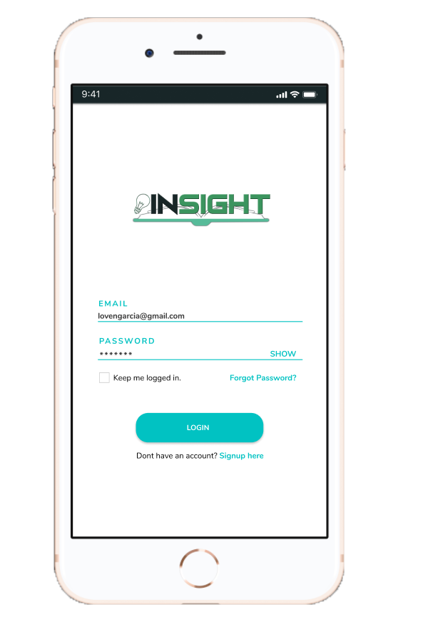
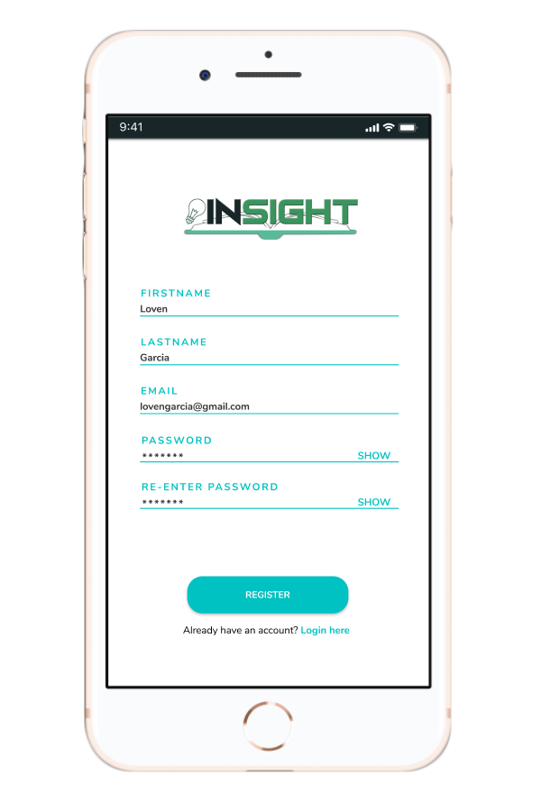
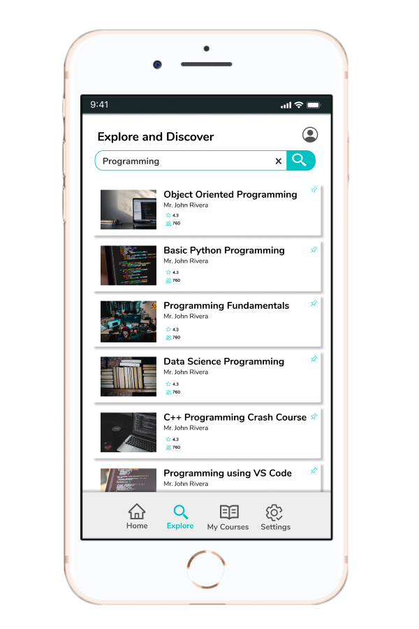
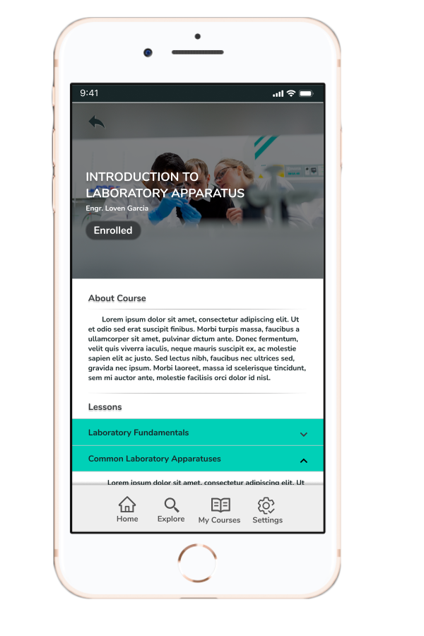
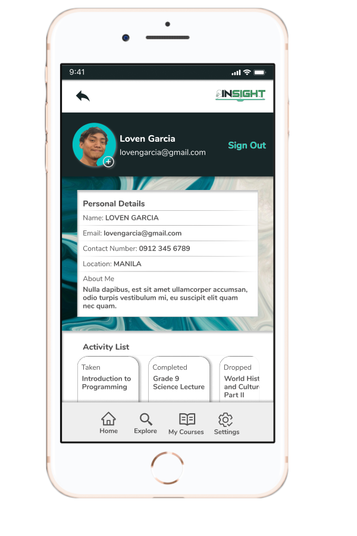

# Insight.ph

## Insight.ph is a mobile-first progressive web application (PWA) developed by students from Mapua University for Hackfest 2020.

[https://insight-ph.netlify.app/](https://insight-ph.netlify.app/)

#### Team Members:
Rane Villanueva 
Van Panugan 
John Rivera 
Loven Garcia 

 
 

 

## Project Documentation
* [Overview](#overview)
* [Setup and Installation](#setup-and-installation)
* [Running the program](#running-the-program)
* [Sample Snapshots](#Sample-snapshots)

 

## Overview
Insight.ph is an educational web application that can provide free online education to Filipinos amidst the pandemic. The application utilizes the Augmented Reality (AR) to deliver laboratory experience online.

You can view it live on [https://insight-ph.netlify.app/](https://insight-ph.netlify.app/)

You can use these following credentials:
* Email: qwe@qwe.qwe
* password: qweqweqwe

## Setup and Installation

To start, install dependencies:

### `npm install` or `yarn install`

Next is to create a file named `.env.local` and add firebase API credentials.
The format is on `.env.example`.

## Running the program

In the project directory, you can run:

### `yarn start` or `npm start`

Runs the app in the development mode.\
Open [http://localhost:3000](http://localhost:3000) to view it in the phone browser or web.

The page will reload if you make edits.
## Sample snapshots

### Sign-in Page

### Sign-up Page

### Home Page

### Explore Page

### Search Courses

### My Courses Page

### Specific Course Page

### Profile Page

